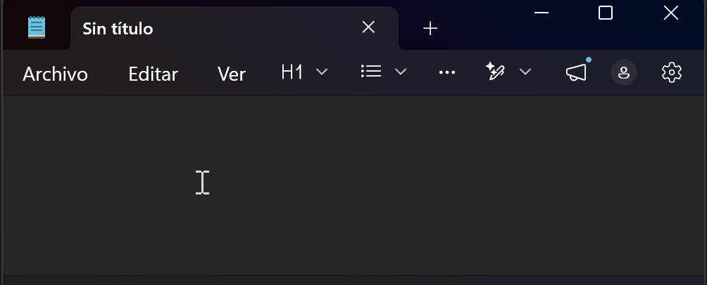
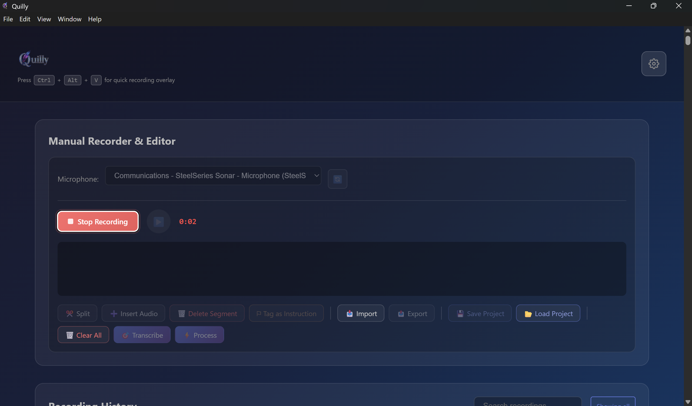
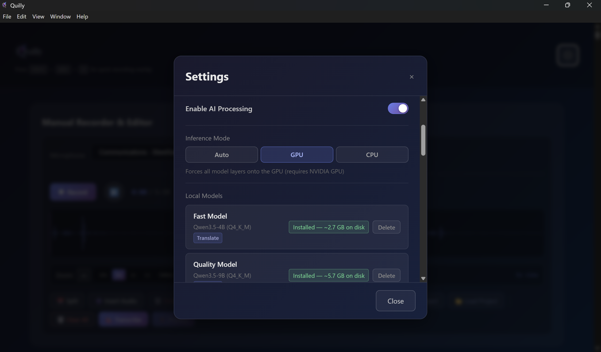

<p align="center">
  
</p>

<h1 align="center">Quilly</h1>

<p align="center">
  <strong>Talk more, type less.</strong><br>
  Free, private voice dictation for Windows — with optional on-device AI polishing.
</p>

<p align="center">
  <a href="https://github.com/alfredorr-ARTRs-pro/Quilly/releases"></a>
  
  
  <a href="https://github.com/sponsors/alfredorr-ARTRs-pro"></a>
</p>

<p align="center">
  
</p>

---

## What is Quilly?

Quilly turns your voice into text — anywhere you can type on Windows.

Press a hotkey, speak naturally, press again to stop. [Whisper](https://github.com/openai/whisper) transcribes your voice locally. Optionally, a small on-device language model polishes the result — fixing grammar, reformatting, translating, answering a question, whatever you asked for. The final text pastes automatically into whatever app you were using.

**Everything happens on your machine.** No cloud, no account, no data ever leaves your device.

## Why Quilly

- **Fully private** — all AI inference runs locally on your CPU or NVIDIA GPU
- **Free and open source** — MIT licensed, no subscriptions, no account
- **Works everywhere in Windows** — any text field in any app, via a global hotkey
- **AI-polished output** — optional local LLM rewrites, translates, summarizes, answers
- **Small and unobtrusive** — a tiny floating indicator, lives in the system tray
- **Hotkey or wake word** — start with a keystroke, or just say your chosen wake word
- **Built-in history** — review past transcriptions, replay the audio
- **GPU-accelerated** — CUDA support for fast inference; CPU-only works too

## See it in action

<p align="center">
  
</p>

### Dashboard

<p align="center">
  
</p>

### Settings

<p align="center">
  
</p>

## How it works

1. **You press the hotkey** anywhere on your desktop — a small indicator appears near your cursor
2. **You speak** — the indicator turns red and shows a live timer
3. **You press the hotkey again** — Quilly stops recording and starts transcribing
4. **Whisper transcribes** your speech locally (no cloud call)
5. *(Optional)* **A local language model reshapes** the text — if you used the AI hotkey, an on-device LLM rewrites / translates / answers
6. **The final text pastes** automatically where your cursor was

Two hotkeys, two modes:

| Hotkey | What happens |
|---|---|
| `Ctrl + Alt + V` | **Transcribe only** — raw text from Whisper, straight to your cursor |
| `Ctrl + Alt + P` | **Transcribe + AI polish** — Whisper + on-device LLM rewrite pipeline |

All hotkeys are customizable in Settings → Hotkeys.

## Install

> **Requires Windows 10 or 11 (64-bit).**

1. Go to the **[Releases page](https://github.com/alfredorr-ARTRs-pro/Quilly/releases)**
2. Download `Quilly-V-X.X.X-Setup.exe` (latest version)
3. Run the installer

### About the SmartScreen warning

The installer isn't code-signed yet (free open-source signing via [SignPath Foundation](https://signpath.org) is being set up). Windows will show:

> **Windows protected your PC**
> Microsoft Defender SmartScreen prevented an unrecognized app from starting.

This is normal for any unsigned open-source Windows app. To continue:

1. Click **More info**
2. Click **Run anyway**

Once code signing is in place, this warning will disappear from future releases.

For a detailed walkthrough including verification and uninstall, see the **[Install Guide](docs/install.md)**.

### Verify the download (optional but recommended)

Every release publishes a SHA-256 hash. Compare before running:

```powershell
Get-FileHash Quilly-V-1.2.0-Setup.exe
```

Match the hash against the one listed on the [Releases page](https://github.com/alfredorr-ARTRs-pro/Quilly/releases).

## Quick start

After installing:

1. Quilly starts silently in your **system tray** (bottom-right corner, near the clock)
2. Open any text field — email, doc, chat, terminal, anything
3. Press **`Ctrl + Alt + V`** and speak
4. Press **`Ctrl + Alt + V`** again to stop

Your words appear where your cursor was.

For AI-polished output, use **`Ctrl + Alt + P`** instead. You can prepend a freeform instruction — say *"translate to Spanish:"* then dictate, or *"fix the grammar in this:"* — and Quilly will understand.

### Wake word (optional)

Prefer not to press hotkeys? Turn on the wake word in Settings. Default is **"Quilly"** (fully configurable — pick any word you like). Say the wake word and start dictating. Quilly detects it automatically and starts listening.

Full hotkey and wake-word reference: **[Hotkeys Guide](docs/hotkeys.md)**.

## AI models

Quilly uses two kinds of local AI models. Both download automatically on first use, from official sources.

### Speech-to-text — Whisper

Choose your model in Settings → AI Models:

| Model | Size | Speed | Accuracy |
|---|---|---|---|
| Tiny | ~75 MB | Fastest | Basic |
| Base | ~142 MB | Fast | Good |
| **Small** *(recommended)* | ~466 MB | Balanced | Very good |
| Medium | ~1.5 GB | Moderate | Excellent |
| Large v3 | ~3.1 GB | Slowest | Best-in-class |

### Language model — Qwen *(optional)*

Only required if you want AI-polished output via `Ctrl + Alt + P`. Download via Settings → AI Models → Language Model:

| Model | Size | Best for |
|---|---|---|
| Qwen **4B** | ~2.7 GB | Most machines, faster inference |
| Qwen **9B** | ~5.7 GB | Best quality, ideal on GPU or 16 GB+ RAM |

### GPU vs CPU

Quilly detects an NVIDIA GPU with CUDA 12.4+ and uses it automatically for much faster inference. Without a GPU, CPU mode works on any modern machine — just slightly slower.

Force a specific mode in Settings → Performance.

Deep dive on models, sizing, and GPU setup: **[AI Setup Guide](docs/ai-setup.md)**.

## Privacy

- **All processing is on your device.** Transcription and language modeling never leave your computer.
- **No telemetry, no analytics, no accounts.**
- **The only network calls** Quilly makes are downloading AI model files from their official repositories (HuggingFace) the first time you enable a model.
- **Your voice recordings** are stored locally in your Windows `AppData` folder. Delete them anytime from Dashboard → History.
- **Open source** — [inspect the code yourself](https://github.com/alfredorr-ARTRs-pro/Quilly).

## System requirements

**Minimum:**
- Windows 10 (64-bit) or Windows 11
- 8 GB RAM
- ~2 GB free disk (app + smallest Whisper model)
- A microphone

**Recommended:**
- 16 GB+ RAM
- NVIDIA GPU with CUDA 12.4+
- ~10 GB free disk (for larger models)

## Troubleshooting

**"Windows protected your PC" on install.**
Expected until the installer is code-signed. Click **More info → Run anyway**. See the [Install](#install) section.

**Nothing happens when I press the hotkey.**
Check the system tray (bottom-right, near the clock) — Quilly should be there. Click the icon to open the Dashboard. If it isn't running, launch Quilly from the Start menu.

**Transcription is slow.**
Try a smaller Whisper model (Settings → AI Models). Tiny and Base are fast even on modest hardware.

**My microphone isn't detected.**
Windows Settings → Privacy & Security → Microphone → confirm "Let desktop apps access your microphone" is **on**.

**AI polishing (`Ctrl + Alt + P`) does nothing.**
Go to Settings → AI Models → Language Model. Download a Qwen model first.

**Can't find my past transcriptions.**
Dashboard → History tab. Everything is there, with audio playback.

For the full issue list and solutions, see the **[Troubleshooting Guide](docs/troubleshooting.md)**. Still stuck? **[Open an issue](https://github.com/alfredorr-ARTRs-pro/Quilly/issues)**.

## FAQ

**Is it really free?** Yes. MIT license, no paid version, no subscription.

**Does it send my voice to the cloud?** No. All processing is on your device.

**Does it work offline?** Yes, once models are downloaded the first time.

**Does it work on Mac or Linux?** Not yet — Windows only. Mac and Linux support are on the roadmap.

**What microphones are supported?** Any microphone Windows recognizes — built-in, USB, Bluetooth, headsets, gaming mics.

**Can I change the hotkeys?** Yes. Settings → Hotkeys.

**How accurate is the transcription?** Small Whisper (default) is very good for clear speech across many languages and stays light on disk. Step up to Medium or Large v3 if you want top-tier accuracy.

**Does it auto-update?** Not yet — check the Releases page. On the roadmap.

**Can I use a different language model?** Currently Qwen only. More options on the roadmap.

## Support the project

Quilly is built and maintained by **A.I.P.S.** as a free tool for the community. If it saves you time or helps your work, consider supporting development — every bit keeps new features coming.

<p align="center">
  <a href="https://github.com/sponsors/alfredorr-ARTRs-pro">
    
  </a>
  &nbsp;&nbsp;&nbsp;
  <a href="https://www.paypal.com/donate/?hosted_button_id=EY723ETLSVH9G">
    
  </a>
</p>

And starring the repo is free and genuinely appreciated.

## Need custom AI solutions?

Quilly is a showcase of what **A.I.P.S.** builds — private, practical AI tools that run on your own hardware.

I'm **Alfredo Rapetta**, and through **A.I.P.S.** I design and build custom AI solutions for businesses — voice interfaces, private AI assistants, desktop automation, data-sovereign LLM deployments, workflow copilots, and everything AI-adjacent.

If you want something like Quilly — or bigger — for your team, let's talk.

**Visit [aips.studio](https://aips.studio)** or reach out via [GitHub Discussions](https://github.com/alfredorr-ARTRs-pro/Quilly/discussions).

## Roadmap

- Code-signed installer (SignPath Foundation application in progress)
- In-app auto-updates
- macOS support
- Linux support
- Custom AI prompt templates
- Multi-language wake-word support
- More language-model options

## Development

Quilly is built with Electron + React + Vite. It bundles [whisper.cpp](https://github.com/ggerganov/whisper.cpp) and [llama.cpp](https://github.com/ggerganov/llama.cpp) for local inference.

```bash
git clone https://github.com/alfredorr-ARTRs-pro/Quilly.git
cd Quilly
npm install
npm run electron:dev
```

Build an installer locally:

```bash
npm run dist
```

More details in [CONTRIBUTING.md](CONTRIBUTING.md).

## Credits

Quilly stands on the shoulders of excellent open-source projects:

- **[whisper.cpp](https://github.com/ggerganov/whisper.cpp)** by Georgi Gerganov — speech-to-text inference (MIT)
- **[llama.cpp](https://github.com/ggerganov/llama.cpp)** by Georgi Gerganov — language-model inference (MIT)
- **[Whisper](https://github.com/openai/whisper)** by OpenAI — transcription model weights (MIT)
- **[Qwen](https://github.com/QwenLM/Qwen)** by Alibaba Cloud — language-model weights (Apache 2.0)
- **[Electron](https://electronjs.org)** — desktop framework (MIT)
- **[React](https://react.dev)** + **[Vite](https://vitejs.dev)** — UI stack (MIT)

Full third-party license texts live in [THIRD_PARTY_LICENSES.md](THIRD_PARTY_LICENSES.md).

## License

MIT — see [LICENSE](LICENSE).

Copyright © 2026 Alfredo Rapetta (A.I.P.S. — [aips.studio](https://aips.studio))

---

<p align="center">
  <sub>Built with care by <a href="https://aips.studio">A.I.P.S.</a></sub>
</p>
